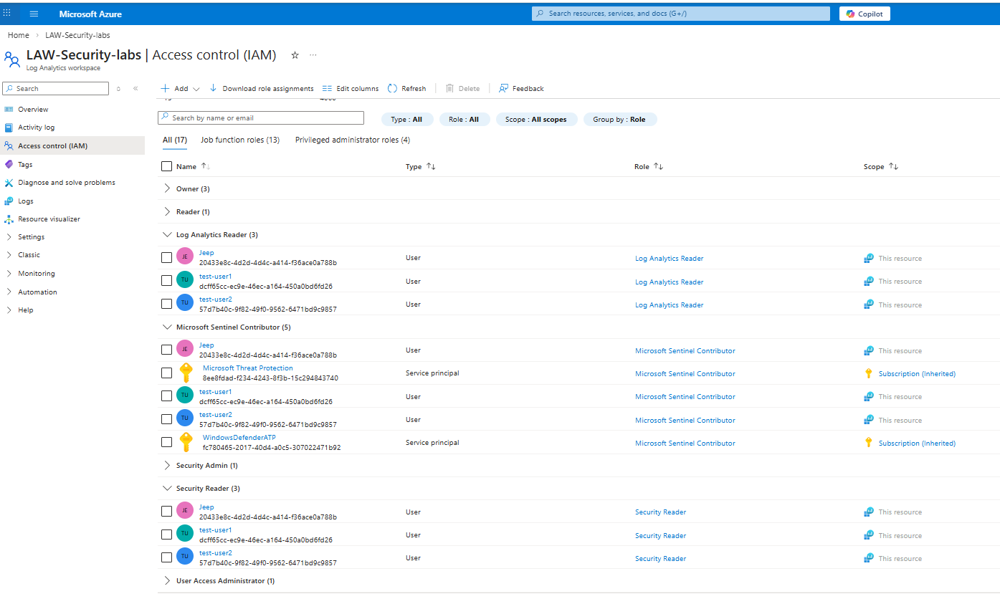
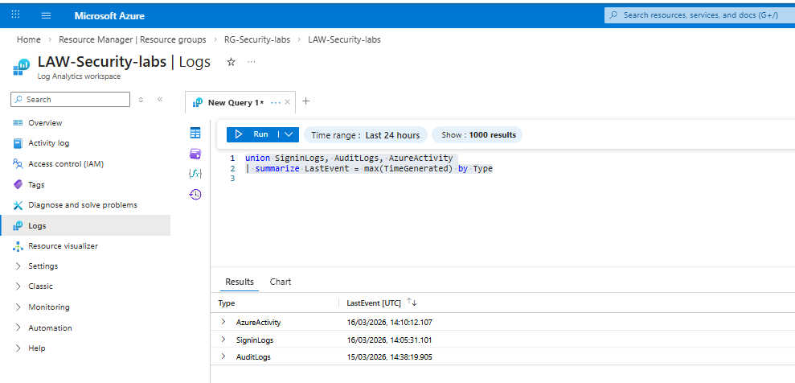

## Sentinel SIEM Deployment & Azure Logging Pipeline

### 🔧 Log Analytics Workspace Creation
Sentinel ingests security telemetry through data connectors that send logs directly to the Log Analytics Workspace (LAW).

#### Screenshot showing Log Analytics Workspace


---

### 🛡️ Microsoft Sentinel Deployment

#### Screenshot - Sentinel enabled on LAW


---

### 🔌 Data Connector Configuration

#### Screenshot - data connectors configured


#### Screenshot - Sign‑in and audit logs in LAW 

 
---

## 📦 Content Hub Installation
Detection content was installed from the Content Hub, populating the **Analytics Rule Templates** section.
#### Screenshot - Content Hub Installed


#### Screenshot -  146 analytics rule templates available


---

### ⚠️ Analytics Rules Configuration
Templates do **not** generate incidents until converted into **active rules**.


---

### 🔐 Access Control (RBAC)
Least‑privilege access was configured on the workspace.

Roles assigned:
- **Sentinel Contributor**  
- **Log Analytics Reader**  
- **Security Reader**  

#### Screenshot -  Assigned roles


---

## 📊 Log Ingestion Validation
KQL query used to validate ingestion:

```kql
union SigninLogs, AuditLogs, AzureActivity
| summarize LastEvent = max(TimeGenerated) by Type
```
#### Screenshot -  Log Ingestion Validation

