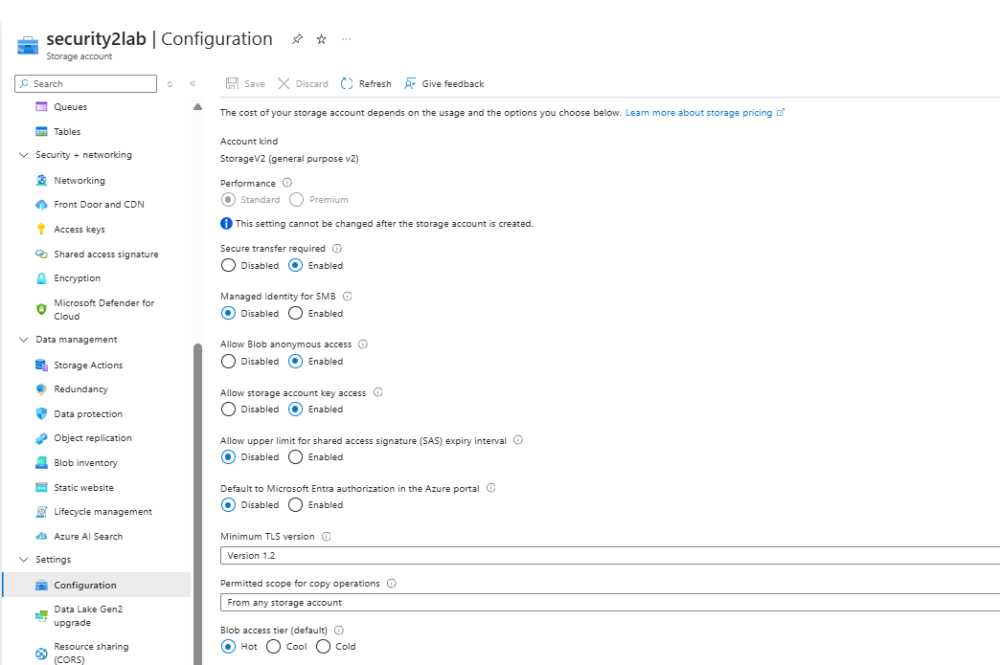

## Lab 2: Anonymous Blob Access Detection & Misconfiguration Analysis

### 1. Objective
Demonstrate how Azure logs unauthenticated blob access when a storage container is misconfigured with public access enabled, and that Azure can detect exposure events.

### 2. Container Configuration

- Set Public Access Level Blob container to intentionally allow anonymous read access.
- Uploaded a test file (test.txt) to generate activity.

#### Screenshot of Storage Blob set to anonymous access


**Important**: Public access is a common real world misconfiguration that exposes data without authentication.

### 3. Anonymous Access Testing

- Copied the blob URL to a private browser window and refreshed multiple times to generate repeated anonymous events. The blob was accessed successfully without authentication, confirming the container was publicly accessible.

#### **Observations**
- Anonymous access does not require SAS tokens, keys, or Azure AD credentials.
- When accessing the blob anonymously, the browser prompted a ‘Save As’ dialog box. This confirms that the blob was publicly accessible without authentication.

### 4. Log Ingestion Verification

#### Confirmed that diagnostic settings were sending:

- StorageBlobLogs
- StorageRead
- StorageWrite

Waited 5 minutes for ingestion. Verified that anonymous access events appeared in StorageBlobLogs.

#### Fields of interest:

- AuthenticationType == "Anonymous"
- OperationName == "GetBlob"
- CallerIpAddress
- Uri

### 5. Detection Queries (KQL)
#### 5.1 Anonymous Access Detection
```
StorageBlobLogs
| where AuthenticationType == "Anonymous"
| summarize AccessCount = count(), Blobs = make_set(Uri, 10)
    by CallerIpAddress, bin(TimeGenerated, 1h)
```

#### Screenshot of Anonymous access KQL query and results


#### 5.2 Container Enumeration Detection  
```
StorageBlobLogs
| where Uri contains "comp=list"
| summarize ListOperations = count()
    by CallerIpAddress, bin(TimeGenerated, 1h)
```

#### Screenshot of Container listing KQL query and results


#### 5.3 High‑Volume Anonymous Reads
```
StorageBlobLogs
| where AuthenticationType == "Anonymous"
| summarize TotalReads = count()
    by bin(TimeGenerated, 1h)
| where TotalReads > 20
```

#### Screenshot of High‑volume access detection results


### 6. Commentary
The lab mirrors real world  incidents where public access leads to data exposure. Anonymous reads, container listings, and repeated access attempts were all captured as expected.

