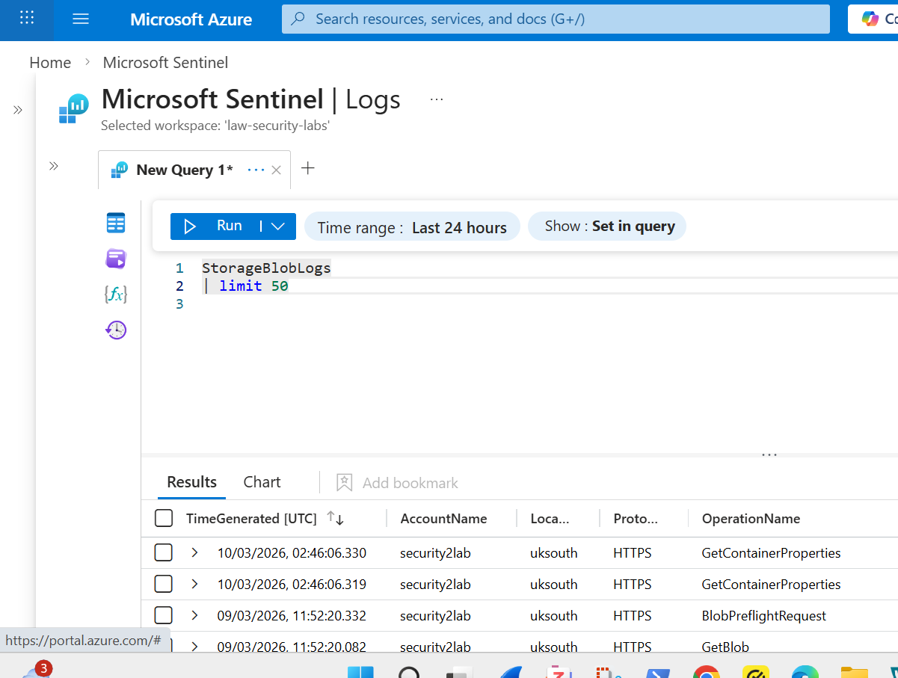

## Lab 3 — Threat Detection Notes

These notes document the full execution of Lab 3, including screenshots, observations, and commentary. They serve as evidence of hands‑on work and reinforce understanding of Azure Storage threat detection.

📦 1. Log Source Verification
Before running detections, I confirmed that both required log sources were flowing into my Sentinel workspace.

### 1.1 StorageBlobLogs

StorageBlobLogs
| limit 10

### 1.2 AzureActivity

AzureActivity
| limit 10

### 1.3 Tables List Verification

Both tables appear in the workspace: StorageBlobLogs and AzureActivity

This validates that the environment is ready for detection engineering.