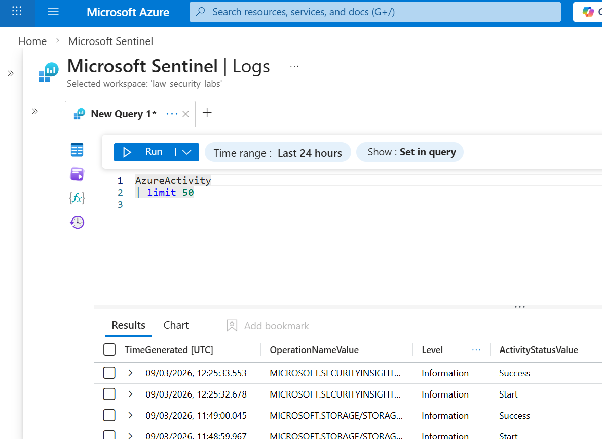
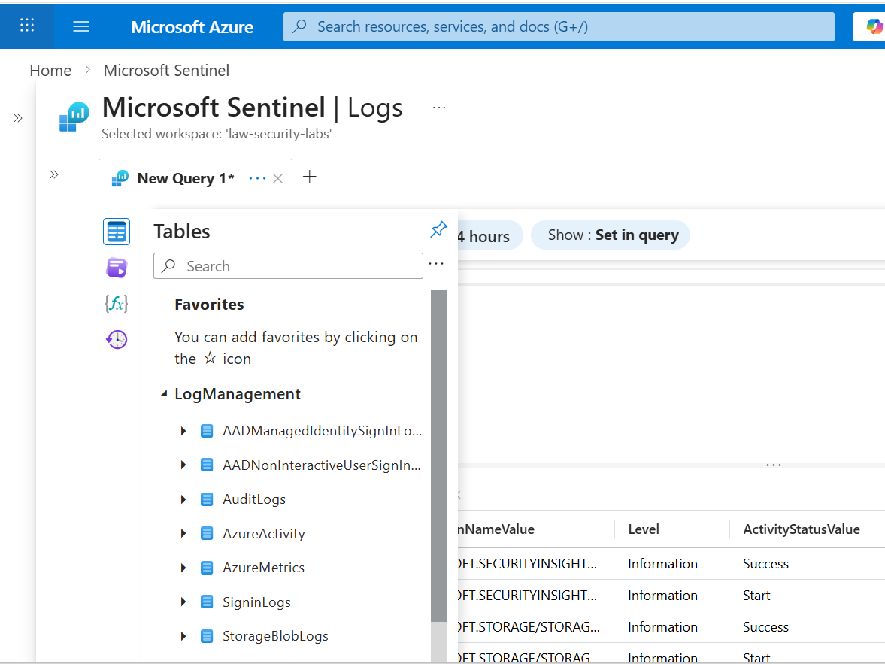
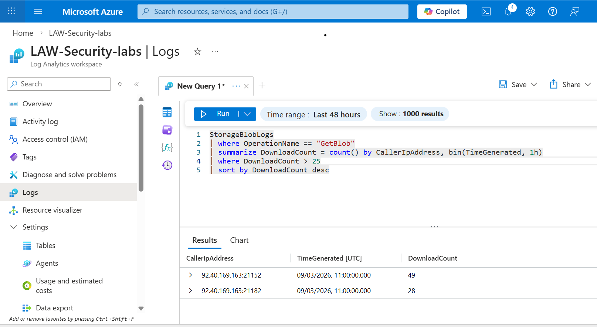
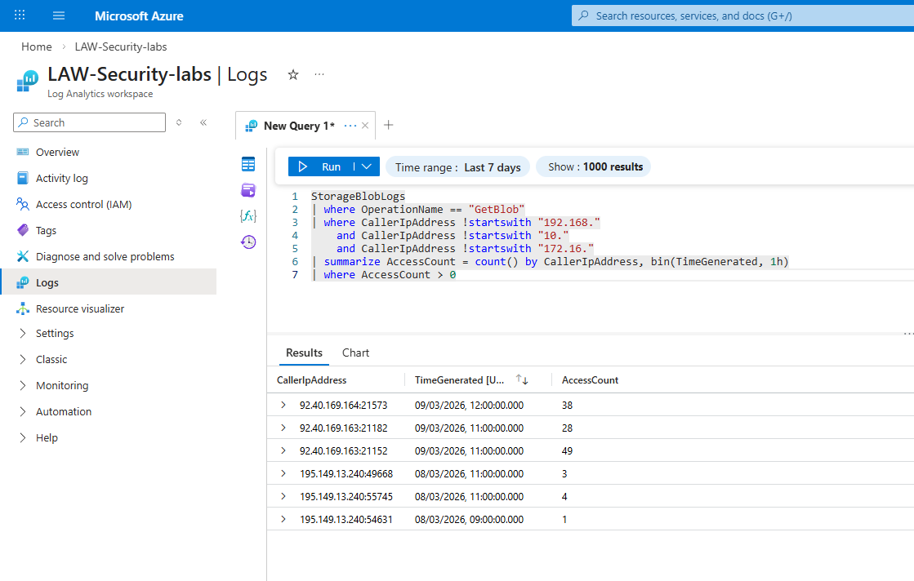
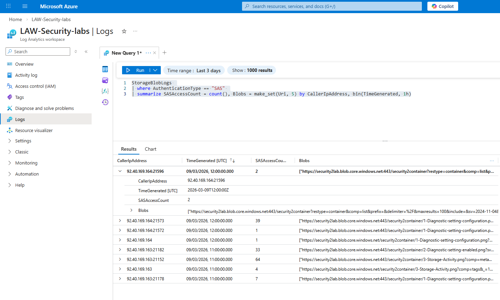
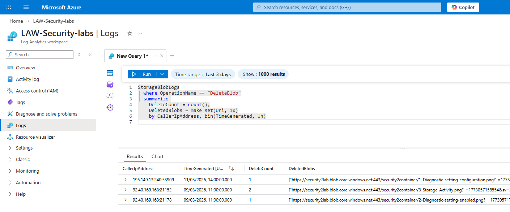

## Lab Azure Threat Detection (StorageBlobLogs + AzureActivity)

### Overview
Azure Storage is a high value target for attackers due to its use for backups, logs, application data, and sensitive files.  
The goal of the lab is to simulate threat detection by analysing blob access logs, identifying anomalies, and mapping detections to MITRE ATT&CK.

### Data Sources
#### StorageBlobLogs
- Blob downloads (GetBlob)  
- Blob deletions (DeleteBlob)  
- Authentication type (Key, OAuth, SAS)  
- Caller IP address  
- URI and container information  
#### AzureActivity
- SAS token creation  
- Storage account key regeneration  
- Network rule changes  
- Role assignments and permission changes  

### Actions Performed
- Uploaded several test blobs, repeatedly downloaded the same blob (10–30 times), generated a SAS token and accessed blobs using SAS and deleted blobs to generate DeleteBlob events  
NB:
StorageBlobLogs only appear when blob operations occur.  AzureActivity logs provide context around SAS creation, key regeneration, RBAC changes, etc.
### 2. Verification of Log Ingestion
#### Queries Run
```kql
StorageBlobLogs
| limit 10
```
```kql
AzureActivity
| limit 10
```
### Detection 1 — Repeated Blob Downloads from the Same IP
Detected repeated blob downloads from the same IP within a 15‑minute window. 
```kql
StorageBlobLogs
| where OperationName == "GetBlob"
| summarize DownloadCount = count() by CallerIpAddress, bin(TimeGenerated, 15m)
| where DownloadCount > 25
| sort by DownloadCount desc
```
- Repeated downloads from a single IP could indicate: automated scripts, credential misuse or early stage data exfiltration
#### MITRE ATT&CK MAPPING:
- Exfiltration (TA0010) and Exfiltration Over Web Services (T1567)
### Detection 2 — Blob Access from Unusual or Non‑Corporate IP Ranges
Detects blob access from non‑private IP ranges. Unexpected IPs may indicate credential compromise or SAS token leakage.
```kql
StorageBlobLogs
| where OperationName == "GetBlob"
| where CallerIpAddress !startswith "192.168."
    and CallerIpAddress !startswith "10."
    and CallerIpAddress !startswith "172.16."
| summarize AccessCount = count() by CallerIpAddress, bin(TimeGenerated, 1h)
| where AccessCount > 0
``` 
#### MITRE ATT&CK MAPPING:
- Initial Access (TA0001) and Valid Accounts (T1078)
### Detection 3 — Blob Access Using SAS TokensStorageBlobLogs
Identifies blob access authenticated using SAS tokens originating from a single public IP, access counts ranged from 1 to 65 per hour and container listing operations confirmed SAS enumeration capability
```kql 
StorageAzureBlobbs
| where AuthenticationType == "SAS"
| summarize SASAccessCount = count(), Blobs = make_set(Uri, 5)
    by CallerIpAddress, bin(TimeGenerated, 1h)
```
- SAS tokens are powerful because: they bypass credentials, they grant scoped access and if leaked, they enable silent data access
#### MITRE ATT&CK MAPPING:
- Defense Evasion (TA0005) and Use of Credentials (T1550)
### Detection 4 — Blob Deletions
```kql 
StorageBlobLogs
| where OperationName == "DeleteBlob"
| summarize DeleteCount = count(), DeletedBlobs = make_set(Uri, 10)
    by CallerIpAddress, bin(TimeGenerated, 1h)
```
- Blob deletions may indicate: Cleanup after data theft, malicious tampering or attempts to hide activity
### MITRE ATT&CK MAPPING:
- Impact (TA0040) and Data Destruction (T1485)
#### Screenshots
##### StorageBlobLogs verification

##### AzureActivity verification

##### Both tables appeared in the workspace, confirming the environment was ready for detection engineering.

##### Repeated Blob Downloads from the Same IP

##### Blob Access from Unusual or Non‑Corporate IP Ranges

##### Blob Access Using SAS Tokens query results

##### Blob deletions query results

#### Results
- Repeated downloads from a single IP address, SAS token usage from a public IP address and blob deletions performed by a test account. These behaviours clearly distinguish normal vs suspicious access patterns
#### Summary
This lab demonstrated: 
- StorageBlobLogs ingestion
- AzureActivity ingestion
- Behavioural detections for blob access
- MITRE ATT&CK‑aligned threat detection logic